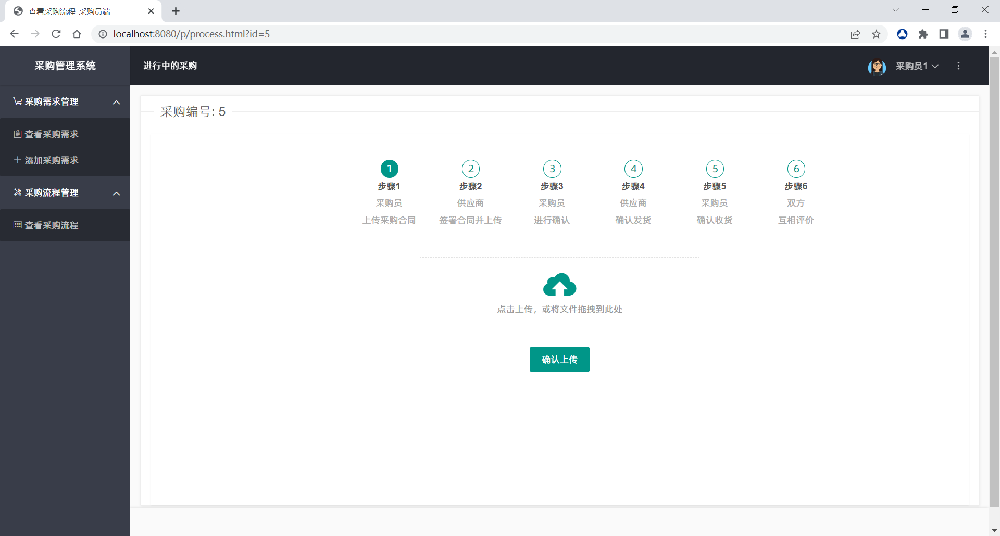

# 基于Spring Boot的采购管理系统

## 项目介绍

本项目是基于Spring Boot的采购管理系统，前端使用Layui，后端使用Spring Boot，数据库使用MySQL，项目采用Maven进行构建。

## 项目演示

部分页面截图如下：

### 登录页面


### 注册页面


### 主页面


### 采购需求列表页面


### 采购流程页面



## 项目结构

```
├─main
│  ├─java
│  │  └─com
│  │      └─example
│  │          └─mypms
│  │              ├─config //配置类
│  │              ├─controller //控制器
│  │              ├─filter //过滤器
│  │              ├─handler //异常处理器
│  │              ├─mapper //MyBatis映射文件
│  │              ├─model //实体类
│  │              ├─plugins //插件类
│  │              └─service //服务类
│  └─resources
│      ├─static //静态资源
│      │  ├─css
│      │  ├─pic
│      │  ├─js
│      │  ├─layui
│      │  ├─p //采购员端
│      │  └─v //供应商端
│      └─templates
├─pom.xml
└─README.md
```

## 技术选型

### 后端技术

| 技术              | 名称       | 官网                                                                                               |
|-----------------|----------|--------------------------------------------------------------------------------------------------|
| Spring Boot     | 容器+MVC框架 | [https://spring.io/projects/spring-boot](https://spring.io/projects/spring-boot)                 |
| Spring Security | 认证和授权框架  | [https://spring.io/projects/spring-security](https://spring.io/projects/spring-security)         |
| MyBatis         | ORM框架    | [http://www.mybatis.org/mybatis-3/zh/index.html](http://www.mybatis.org/mybatis-3/zh/index.html) |
| MySQL           | 数据库      | [https://www.mysql.com/](https://www.mysql.com/)                                                 |
| Maven           | 项目构建管理   | [http://maven.apache.org/](http://maven.apache.org/)                                             |

### 前端技术

| 技术      | 名称     | 官网                                                         |
|---------|--------|------------------------------------------------------------|
| Layui   | 前端UI框架 | [http://layui.org.cn/](http://layui.org.cn/)               |
| jQuery  | 函式库    | [http://jquery.com/](http://jquery.com/)                   |
| ECharts | 图表库    | [https://echarts.apache.org/](https://echarts.apache.org/) |

## 开发环境

| 工具            | 版本号      | 下载                                                                                 |
|---------------|----------|------------------------------------------------------------------------------------|
| IntelliJ IDEA | 2019.1.3 | [https://www.jetbrains.com/idea/download](https://www.jetbrains.com/idea/download) |
| Navicat       | 12.1.19  | [http://www.formysql.com/xiazai.html](http://www.formysql.com/xiazai.html)         |
| MySQL         | 8.0.16   | [https://www.mysql.com/](https://www.mysql.com/)                                   |

## 开发指南

### 直接运行

1. 前往 Release 页面下载最新版本的压缩包
2. 解压压缩包，运行pms_localhost-dump.sql文件，创建数据库
3. 修改application.yml文件中的数据库连接信息
4. 参照如下命令运行项目

```
java -jar .\MyPMS-1.0.*.jar --spring.config.location=.\application.yml
```

### 源代码运行

1. 克隆源代码到本地，使用IntelliJ IDEA打开，并导入Maven依赖
2. 在MySQL中创建数据库pms，并导入项目根目录下的pms_localhost-dump.sql文件
3. 修改application.yml文件中的数据库连接信息
4. 运行MyPmsApplication.java文件
---
项目中的图片资源均来自网络，如有侵权，请联系我删除
